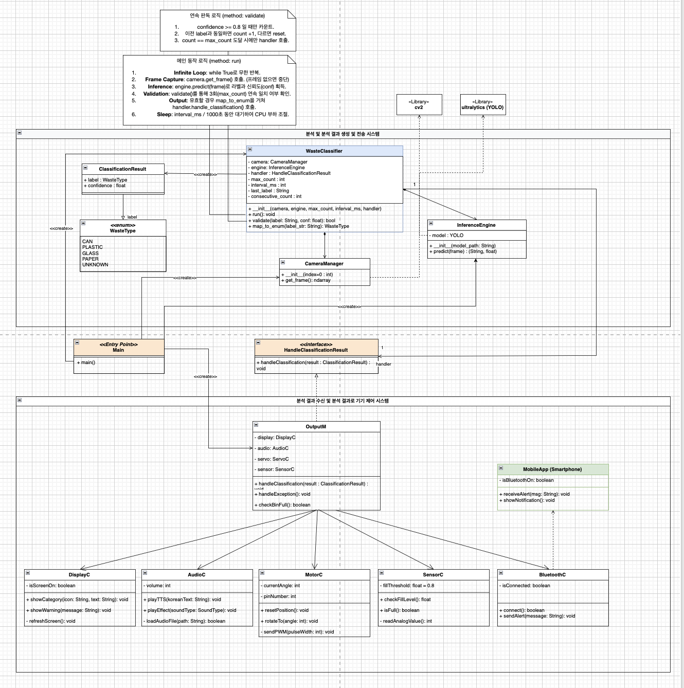

# EcoSort-AIoT

YOLOv8 + Raspberry Pi 기반 온디바이스(On-device) 폐기물 자동 분류 시스템  

## Project Overview

- Raspberry Pi 4에서 YOLO로 폐기물을 온디바이스 분류합니다.
- 분류 결과를 Servo Motors 제어로 연결해 자동 분류 동작을 수행합니다.

## Key Features

- Real-time AI Vision: YOLOv8 기반 고속 객체 탐지.
- Precision Actuator Control: 분류 결과 기반 Servo 정밀 제어.

## System Architecture

- IoT: Raspberry Pi 4, Servo Motors, IR/Ultrasonic Sensors
- AI: YOLOv8 Nano (Optimized for Edge)
- Mobile: Local Network/Bluetooth 알림 채널

## Class Diagram



## Setup

```bash
python3 -m venv .venv
source .venv/bin/activate
python -m pip install --upgrade pip
```

## Install Dependencies

```bash
python -m pip install -r requirements.txt
```

## Run

```bash
python -m src.main
```

## Test

```bash
python -m pytest tests/
```

## Project Structure

### Current

```text
.
├── src/
└── tests/
```

### Planned

```text
src/
├── mobile/
└── sensors/
```
